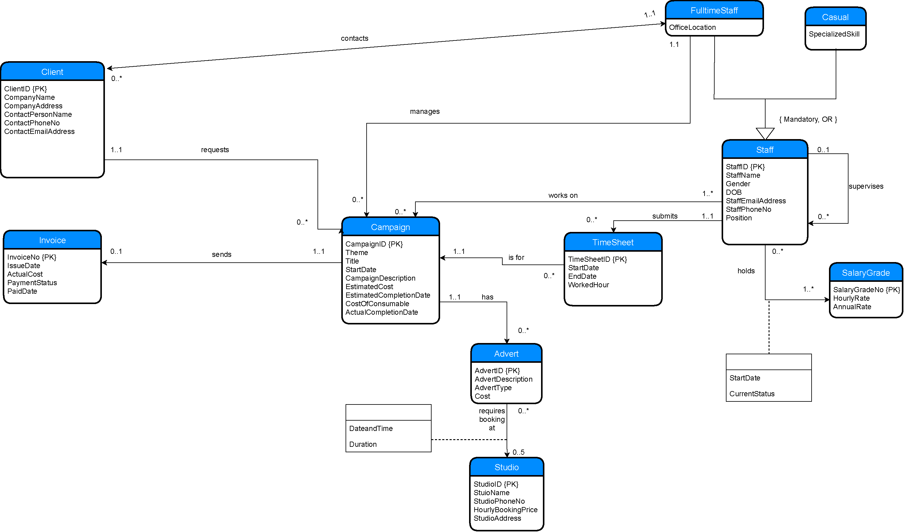
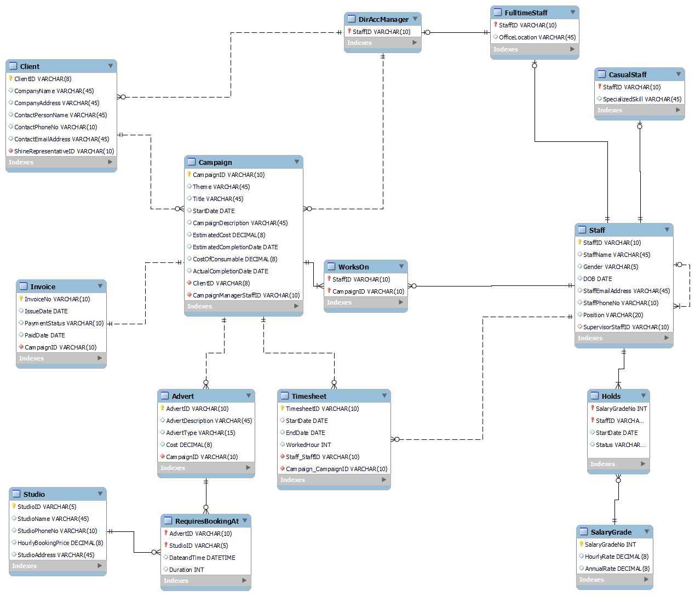

# Database Design and Implementation
*Prepared for ISYS224 - Database Design and Implementation - Macquarie University 2019*  
***by Hoang Van Le***

This repository is created to show my work in the unit ISYS224 - Database Design and Implementation.
## Set up
* Software used for this assessment is MySQL Workbench (8.0 CE).
* DDL.sql is the script where I defined the tables and their relations.
* DML.sql contains the script for inserting records into the tables.
* queries.sql stores the script to answer the queries shown later in task specifications.

## **Problem domain**
This question deals with a system used by an advertising agency called Shine to manage
clients’ advertising campaigns. Shine has a number of full-time staff members (such as
directors, administrative personnel, accountants, account managers, technical personnel)
and also a number of casual staff members (such as actors, models, graphic designers) who
can offer specialized skills for each advertising campaign for its clients. Casual staff
members do not have a permanent office in the agency and are contacted on their mobile
phone. Shine has a hierarchical management structure where each staff member (except
for the managing director) reports to a single supervisor within the company.
Shine deals with other companies as its clients. A record is kept of each client company, and
each client company has one main contact person with Shine. Similarly, Shine nominates a
full-time member of its staff – a director, or an account manager to be the contact for each
client. Casual staff members are not eligible to be contact persons.
Shine runs advertising campaigns for its clients, and a record is kept of every campaign.
Each campaign is based on a unique theme. One full-time member of Shine’s staff, again
either a director or an account manager, manages each campaign. Shine staff may work on
zero, or one or more campaigns at a time. For each campaign they work on, they are
answerable to the manager of that campaign, who may or may not be their own supervisor.
When a campaign starts, an estimate of the cost and finish date needs to be set and agreed
upon. Each campaign includes one or more adverts. Adverts can be one of several types:
websites, newspapers, magazines, TV, etc. Shine currently operates five studios and each
advert may require a few bookings of studios for a number of hours on specific times and
dates. Shine charges an hourly rate for studio bookings. The actual cost of a campaign is
calculated from a range of information such as: cost of staff time, cost of studio time, cost
of consumables etc.
The system also holds a number of fixed salary grades and annual and hourly pay rates of
each grade, so that the cost of staff time on a campaign can be calculated from the
timesheets that they fill out. Shine pays annual salaries to full-time staff but it charges
hourly pay rates to its clients. Casual staff members are also graded and they are paid based on an hourly pay rate charged directly to the clients. Please note that (both full-time and
casual) staff members can have different salary grades during the campaign period (for
instance, when a staff member is given a pay rise right in the middle of a campaign).
When the campaign is completed, an actual completion date and the actual cost are
recorded and a single invoice for the whole campaign is sent to the client. The issue date
and payment status of the invoice are also recorded. When the client pays, the date paid is
recorded.
   

## **Task Specifications**

### Conceptual Model
Construct a conceptual data model in the form of an enhanced ER (EER) model for the above problem domain.  
***Answer:***  

However, as I wanted to seperate Director and Account Manager from full-time staff enity (a child of full-time staff entity) because they have exclusive functions such as being the main contact to a client and being a campaign manager. The conceptual model I constructed in MS Workbench is as followed:  

*	Generalization/specialization: A director or an account manager is a full-time staff. A full-time staff can optionally be a director or an account manager. A staff must be a full-time staff or a casual staff.
*	Weak entity types:  
	FulltimeStaff, CasualStaff, and Director/Manager: cannot exist without the strong entity type Staff.  
	Advert: cannot exist without Campaign.  
	Timesheet: cannot exist without Staff.  
	Invoice: cannot exist without Campaign.

*	Attributes on relationships: Relationships between Advert and Studio (requires bookings at), and Staff and SalaryGrade (holds) have attributes on them. The RequiresBookingsAt relationship needs to have Date and Time as well as duration according to the problem domain; and the Holds relationship needs a timestamp and status to be fully identified.
*	Assumptions: 
 	Total Cost of consumables for an entire campaign is entered into the system for that campaign.
  	CurrentStatus in Holds: OnGoing for a current salary grade, Ended for a past salary grade.
  	For each Timesheet submitted, a staff includes only his/her work for a single Campaign (that is, his/her work for another campaign should be in another timesheet).
      A full-time staff needs to become a Director or an Account Manager before taking charge of his/her first campaign or becoming the main contact to a client.

### Inserting data into tables
Create and run the DML scripts to insert records into each of your tables.  

***Answer:***  

**Table Advert**
|AdvertID|AdvertDescription|AdvertType|Cost|CampaignID|
|--- |--- |--- |--- |--- |
|Ad001.012|Some random descriptions|Magazines|800000|CPN001|
|Ad001.013|Some random descriptions|Online|100000|CPN001|
|Ad002.023|Some random descriptions|TV|4000000|CPN002|
|Ad002.024|Some random descriptions|Magazines|2000000|CPN002|
|Ad003.034|Some random descriptions|Newspaper|200000|CPN003|
|Ad004.045|Some random descriptions|Online|250000|CPN004|
|Ad004.046|Some random descriptions|TV|1500000|CPN004|
|Ad005.057|Some random descriptions|TV|15000000|CPN005|

  

**Table Campaign**  

|CampaignID|Theme|Title|StartDate|CampaignDescription|EstimatedCost|EstimatedCompletionDate|CostOfConsumable|ActualCompletionDate|ClientID|CampaignManagerStaffID|
|--- |--- |--- |--- |--- |--- |--- |--- |--- |--- |--- |
|CPN001|Health|ABC skin care|2017-08-19|Some random descriptions|2000000|2018-08-19|25000|2018-10-02|CL004|Staff005|
|CPN002|Luxury|DEF cars|2018-01-15|Some random descriptions|7000000|2018-08-15|55000|2018-07-01|CL001|Staff001|
|CPN003|Friendly animals|MN Pet product|2018-02-01|Some random descriptions|1000000|2018-07-01|5000|2018-09-15|CL017|Staff009|
|CPN004|Beauty|XYZ perfume|2018-12-25|Some random descriptions|3000000|2019-04-25|15000|2019-04-15|CL013|Staff009|
|CPN005|Economy|OS banking|2019-05-15|Some random descriptions|20000000|2019-12-15|75000|2019-11-01|CL019|Staff016|

  

**Table Casual Staff**

|StaffID|SpecializedSkill|
|--- |--- |
|Staff101|Graphic design|
|Staff106|Acting|
|Staff107|Acting|
|Staff112|Modeling|
|Staff126|Modeling|

  

**Table Client**

|ClientID|CompanyName|CompanyAddress|ContactPersonName|ContactPhoneNo|ContactEmailAddress|ShineRepresentativeID|
|--- |--- |--- |--- |--- |--- |--- |
|CL001|Company A|AA Street, Sydney, NSW|Andrew A.|73591157|andy.a@companya.com.au|Staff001|
|CL004|Company B|BB Street, Sydney, NSW|Becky B.|27544573|becky.b@companyb.com.au|Staff005|
|CL013|Company F|FF Street, Sydney, NSW|Frank F.|18567483|franky.f@companyf.com.au|Staff009|
|CL017|Company H|HH Street, Sydney, NSW|Howard H.|93183082|howie.h@companyh.com.au|Staff009|
|CL019|Company S|SS Street, Sydney, NSW|Steven S.|18365463|stevie.s@companys.com.au|Staff016|

  

**Table Director/Account Manager**

|StaffID|
|--- |
|Staff001|
|Staff005|
|Staff009|
|Staff010|
|Staff016|

  

**Table Full-time Staff**

|StaffID|OfficeLocation|
|--- |--- |
|Staff001|Room 301/ L3/ Main Bdg|
|Staff005|Room 302/ L3/ Main Bdg|
|Staff009|Room 201/ L2/ Main Bdg|
|Staff010|Room 202/ L2/ Main Bdg|
|Staff016|Room 203/ L2/ Main Bdg|
|Staff025|Room 101/ L1/ Main Bdg|
|Staff036|Room 102/ L1/ Main Bdg|
|Staff049|Room 103/ L1/ Main Bdg|

  

**Table Holds**

|SalaryGradeNo|StaffID|StartDate|Status|
|:---:|--- |--- |--- |
|1|Staff107|2017-01-01|Ongoing|
|1|Staff126|2017-01-01|Ongoing|
|2|Staff101|2017-01-01|Ongoing|
|2|Staff106|2017-01-01|Ongoing|
|2|Staff112|2017-01-01|Ongoing|
|3|Staff025|2017-01-01|Ongoing|
|3|Staff036|2017-01-01|Ongoing|
|3|Staff049|2017-01-01|Ongoing|
|4|Staff009|2016-01-01|Ongoing|
|4|Staff010|2016-01-01|Ongoing|
|4|Staff016|2017-01-01|Ongoing|
|5|Staff001|2014-01-01|Ongoing|
|5|Staff005|2014-01-01|Ongoing|

  

**Table Invoice**
|InvoiceNo|IssueDate|PaymentStatus|PaidDate|CampaignID|
|--- |--- |--- |--- |--- |
|124673|2018-07-21|Paid|2018-07-26|CPN002|
|194793|2019-11-10|Unpaid|NULL|CPN005|
|357489|2018-10-04|Paid|2019-01-11|CPN003|
|424345|2018-11-27|Paid|2018-12-14|CPN001|
|454954|2019-05-06|Paid|2019-06-16|CPN004|

  

**Table RequiresBookingAt**

|AdvertID|StudioID|DateandTime|Duration|
|--- |:---:|--- |:---:|
|Ad001.012|Su04|2017-11-01 16:00:00|40|
|Ad002.023|Su03|2017-03-13 18:00:00|100|
|Ad002.024|Su03|2017-04-10 19:00:00|30|
|Ad004.046|Su01|2018-01-01 18:00:00|60|
|Ad005.057|Su02|2019-05-25 18:00:00|15|
|Ad005.057|Su05|2019-05-29 18:00:00|30|

  

**Table Salary Grade**

|SalaryGradeNo|HourlyRate|AnnualRate|
|:---:|:---:|---:|
|1|30|60000|
|2|40|80000|
|3|50|100000|
|4|60|120000|
|5|75|150000|

  

**Table Staff**

|StaffID|StaffName|Gender|DOB|StaffEmailAddress|StaffPhoneNo|Position|SupervisorStaffID|
|--- |--- |--- |--- |--- |--- |--- |--- |
|Staff001|Anthony A.|M|1970-06-13|anthony.a@shine.com.au|14637347|Director|NULL|
|Staff005|Caroline C.|F|1980-06-03|carol.c@shine.com.au|23842574|Director|Staff001|
|Staff009|Daniel D.|M|1980-01-01|dan.d@shine.com.au|21855940|Account manager|Staff001|
|Staff010|Evelyn E.|F|1982-12-21|eve.e@shine.com.au|27194673|Account manager|Staff005|
|Staff016|Helen H.|F|1984-02-03|helen.h@shine.com.au|84757437|Account manager|Staff005|
|Staff025|Lucas L.|M|1990-03-22|luc.l@shine.com.au|37205848|Technical Personnel|Staff009|
|Staff036|Pauline P.|F|1992-04-05|pauline.p@shine.com.au|24927457|Admin Personnel|Staff010|
|Staff049|Thomas T.|M|1989-09-05|tom.t@shine.com.au|14756933|Accountant|Staff016|
|Staff101|Lewis L.|M|1994-12-07|ll1234@gmail.com|38545744|Graphic designer|Staff025|
|Staff106|Benny B.|M|1965-05-11|bb9999@gmail.com|81364474|Actor|Staff036|
|Staff107|Mary M.|F|1995-09-28|mm4321@gmail.com|17374754|Actor|Staff036|
|Staff112|Rachel R.|F|1996-01-31|rr5678@gmail.com|95762359|Model|Staff049|
|Staff126|Victoria V.|F|1995-05-23|vv0000@gmail.com|73465913|Model|Staff049|

  

**Table Studio**

|StudioID|StudioName|StudioPhoneNo|HourlyBookingPrice|StudioAddress|
|--- |--- |--- |--- |--- |
|Su01|Magpie|43432541|200|1 Studio Rd, Sydney NSW|
|Su02|Raven|23854948|250|2 Studio Rd, Sydney NSW|
|Su03|Cuckoo|25795772|150|3 Studio Rd, Sydney NSW|
|Su04|Cockatoo|82567273|275|4 Studio Rd, Sydney NSW|
|Su05|Sparrow|63314842|340|5 Studio Rd, Sydney NSW|

  

**Table Timesheet**

|TimesheetID|StartDate|EndDate|WorkedHour|Staff_StaffID|Campaign_CampaignID|
|--- |--- |--- |--- |--- |--- |
|TS00001|2017-01-15|2018-07-01|600|Staff001|CPN002|
|TS00012|2017-08-19|2018-10-02|1400|Staff005|CPN001|
|TS00023|2018-02-01|2018-09-15|800|Staff009|CPN003|
|TS00134|2017-08-19|2017-11-15|160|Staff025|CPN001|
|TS00143|2018-12-25|2019-04-15|400|Staff009|CPN004|
|TS00243|2019-05-15|2019-11-01|650|Staff016|CPN005|
|TS00832|2019-06-15|2019-06-15|20|Staff106|CPN005|
|TS01112|2019-05-15|2019-08-01|180|Staff025|CPN005|
|TS02312|2017-10-10|2017-10-18|25|Staff107|CPN001|
|TS03252|2017-02-20|2017-02-21|12|Staff112|CPN002|
|TS03432|2018-02-01|2018-04-15|240|Staff025|CPN003|
|TS05353|2017-09-10|2017-09-28|100|Staff101|CPN001|
|TS07426|2019-02-01|2019-02-15|80|Staff101|CPN004|
|TS07635|2019-03-25|2019-04-15|50|Staff049|CPN004|
|TS08563|2019-04-01|2019-04-05|15|Staff107|CPN004|
|TS23512|2018-02-11|2018-02-12|10|Staff126|CPN003|
|TS24516|2019-04-09|2019-04-13|21|Staff126|CPN004|

  

**Table WorksOn**

|StaffID|CampaignID|
|--- |--- |
|Staff001|CPN002|
|Staff005|CPN001|
|Staff009|CPN003|
|Staff009|CPN004|
|Staff016|CPN005|
|Staff025|CPN001|
|Staff025|CPN003|
|Staff025|CPN005|
|Staff049|CPN004|
|Staff101|CPN001|
|Staff101|CPN004|
|Staff106|CPN005|
|Staff107|CPN001|
|Staff107|CPN004|
|Staff112|CPN002|
|Staff126|CPN003|
|Staff126|CPN004|

### Queries
The script for the following queries can be found in queries.sql
* List the titles and themes of the Campaigns’ whose actual costs are below the average
estimated cost of all the campaigns.  
**Result:**

    |Title|Theme|
    |--- |--- |
    |XYZ perfume|Beauty|
    |DEF cars|Luxury|
    |ABC skin care|Health|
* List the campaign titles and the number of their advertisements whose completion
dates were earlier than their target dates.  
**Result:**

    |Title|Number of Adverts|
    |--- |---:|
    |DEF cars|2|
    |XYZ perfume|2|
    |OS banking|1|
* List all the names of full-time staff members whose supervisor(s) were not the managers of the campaigns they worked on.  
**Result:**

    |staffname|
    |--- |
    |Caroline C.|
    |Lucas L.|
    |Daniel D.|
    |Daniel D.|
    |Thomas T.|
    |Helen H.|
    |Lucas L.|
* For campaigns with more than two staff members working on them, list the campaign
title and the number of staff members who had salary grade greater than 2. 
**Result:**

    |Campaign title|Number of Staff having salary grade >2|
    |--- |--- |
    |ABC skin care|2|
    |MN Pet product|2|
    |XYZ perfume|2|
    |OS banking|2|

* List all the full-time staff members who do not manage any campaigns. 
**Result:**

    |StaffID|StaffName|OfficeLocation|Gender|DOB|StaffEmailAddress|StaffPhoneNo|Position|SupervisorStaffID|
    |--- |--- |--- |--- |--- |--- |--- |--- |--- |
    |Staff010|Evelyn E.|Room 202/ L2/ Main Bdg|F|1982-12-21|eve.e@shine.com.au|27194673|Account manager|Staff005|
    |Staff025|Lucas L.|Room 101/ L1/ Main Bdg|M|1990-03-22|luc.l@shine.com.au|37205848|Technical Personnel|Staff009|
    |Staff036|Pauline P.|Room 102/ L1/ Main Bdg|F|1992-04-05|pauline.p@shine.com.au|24927457|Admin Personnel|Staff010|
    |Staff049|Thomas T.|Room 103/ L1/ Main Bdg|M|1989-09-05|tom.t@shine.com.au|14756933|Accountant|Staff016|
